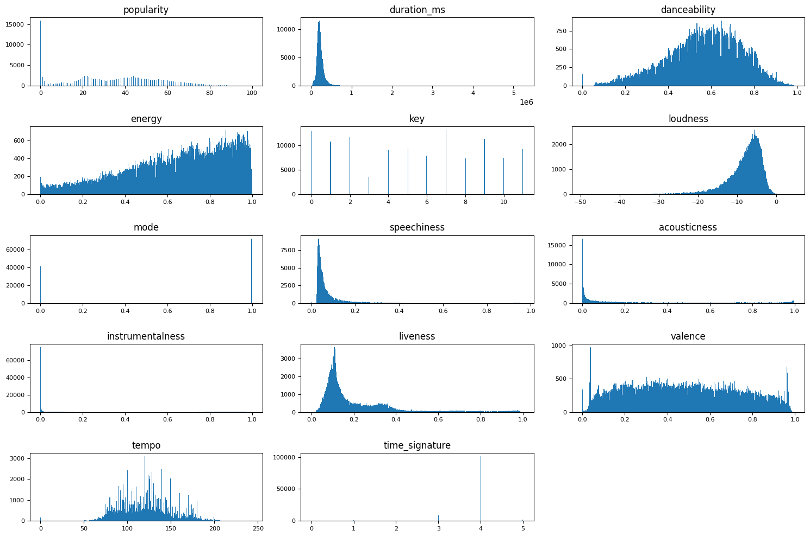
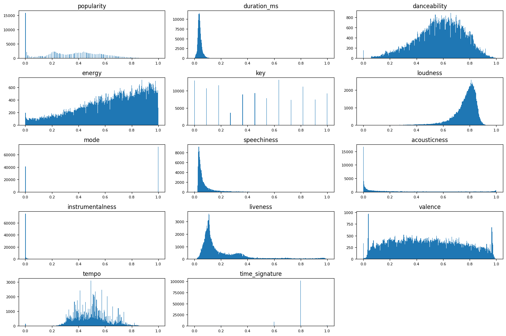
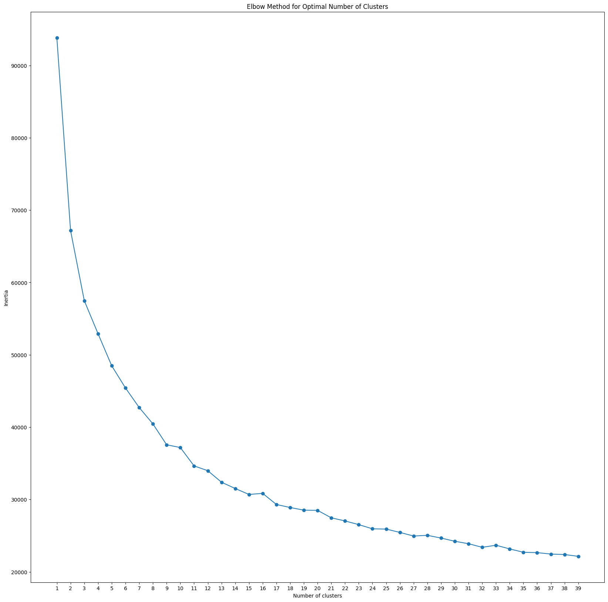
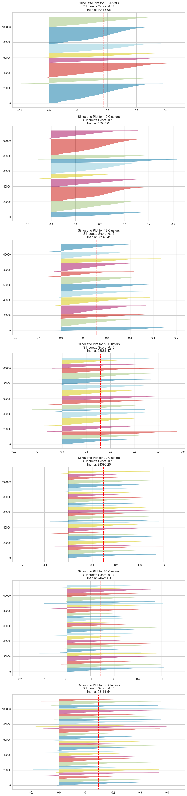

# ChangeLog

## Changes

### Collab Notebook
If you wish to experiment with the code, you can find the notebook on Google Collab at the link below.<br> 
[Collab Notebook - Spotify Recommendations](https://colab.research.google.com/drive/1LK2YCIj0SzYWSZvoJTTqDEWu8G5eIaBQ?usp=drive_link)
<br>
### Project Goals
 This project was inspired and guided by a Jupyter notebook explaining the K Means Clustering algorithm. This notebooks can be found [here](https://github.com/jakevdp/PythonDataScienceHandbook/blob/master/notebooks/05.11-K-Means.ipynb) for reference.
  The notebook gives an overview of the K Means algorithm and supplies some examples of its use in unsupervised learning tasks such as identifying digits with no labels and also color compression. The goal of this project is to use K Means algorithm to cluster Spotify songs in an attempt to find patterns that can be used to create song recommendations for users.

### Data Source
<p> The source notebook retrieves the data it uses for its predictions from included datasets within the sklearn platform. This project instead sources its data from kaggle with the dataset described below:

1. **Spotify Tracks Dataset**
    - **Description**: This dataset contains a number of feature for 114,000 Spotify tracks. The dataset was compiled for machine learning tasks and contains 21 seperate features describing attributes of different songs within the Spotify catalog. 
    - **Usage**: This dataset will be used to develop clusters that can be used to generate song recommendations.
    - **Source Quality**: This dataset was sourced from Kaggle and has a high usability score from Kaggle users.
    - **Link**: [here](https://www.kaggle.com/datasets/maharshipandya/-spotify-tracks-dataset/data)

### Data Exploration
<p> As this project is using a different dataset, some data exploration and preprocessing is required to make sure the data is clean and ready for modelling. The first steps in data exploration was to perform preliminary data exploration and then use a visualsation to analysis the data distribution among the numerical feature which will be included in the K Means model. To perform this analysis the following histograms were created.</p>



Using this visualisation we can attempt to any skews in data or explore the feature value distributions. From the charts we can see that:
1. Features have very different scales so will need normalisation.
2. Time Signature is highly skewed with most songs in the 4 category, dropping this column may be necessary.
3. Mode is binary, either 0 or 1, with a skew towards 1.
4. Instrumentalness has mostly very low values, normalisation should fix any imbalance this may cause.
5. Many columns such dancebility and loudness have a normal distribution.
These subplots provide a valuable visual insight into any imbalances in the dataset in terms of variable value distributions. Looking at this chart we can see where the dataset may introdcause issues when trained with this data.

### Data Preprocessing

#### Cleaning dataset
The reference notebook uses a dataset which is already cleaned. This project's dataset needed to be checked for null or duplicate values which was performed with the following code:

```
#Dropping null values
df.dropna(inplace=True)

df.drop_duplicates(inplace=True)

from sklearn.model_selection import train_test_split
X_train, X_test, y_train, y_test = train_test_split(X, y, test_size=0.3, random_state=0)

```
Only one row contained null values and 450 rows out of 114,000 were duplicates.

#### Reducing dimensions
The next preprocessing step was to drop the time_signature column as it contained highly skewed values so was a good candidate to drop to reduce data dimensionality.

#### Normalisation
Data exploration showed that the numerical features had very different scales so a MinMaxScalar was used to normalise all features.

```
clustering_features = df.select_dtypes(include=['int64', 'float64'])
clustering_features
scaler = MinMaxScaler()
# Scale numerical columns
X_scale = scaler.fit_transform(clustering_features)
```
The following graphs show the data after normalisation.


### Model Creation

#### Model 1
For the creation model one, a random n was picked to generate a comparison basis for later more refined models.

```
kmeans = KMeans(n_clusters=3)
kmeans.fit(X_scale)

```
The k value is a hyperparameter which controls the number of clusters which the K Means model tries to generate centroids for. 

#### Model Evaluation 
Model evaluation in unsupervised learning is more complicated as we do not have labels which we can use to evaluate model performance. To assess how the model performed two metrics were used.
1. **Inertia**: Inertia is the sum of squares distances of samples to their cluster centroid. Higher values indicate clusters are more spread out and less well defined.
2. **Silhouette**: Silhouette score is another metric which can be used to measure K Means performance. This metric not only considered the distances of samples to their own cluster centroid but also the average distance of samples to all samples in their nearest neighbouring cluster. Higher silhouette scores indicate that clusters are well seperated from other clusters and have high cohesion. Silhouette score is between 1 and -1 with higher values indicating better performance.

The results for Model 1 were:
- Inertia: 57,483
- Silhouette: 0.25

Looking at these results we can say that inertia seems high given our feature are normalised on a scale between 0 and 1, however, comparing this result to later models will give a better view on this figure. The silhouette score of 0.25 is a reasonable result but does indicate there is some overlap in clusters. This is to be expected however given the dimensionality of the dataset being utilised.

#### Model 2
Model 2 will use the Elbow method to attempt to identify the optimal n value for clustering. This method calculates the inertia metric for a number of n values and picks the n value where the rate that inertia is decreasing begins to slow. For this values from 1 to 40 will be evaluated.

```
import matplotlib.pyplot as plt
from sklearn.cluster import KMeans

# List for inertia values
inertia = []

# Range of clusters
clusters_range = range(1, 40)

# Calculate inertia for each
for k in clusters_range:
    kmeans = KMeans(n_clusters=k)
    kmeans.fit(X_scale)
    inertia.append(kmeans.inertia_)
```

The following visualisation was created to view inertia's rate of decrease.


##### Model Evaluation
The results from Model 2 show the difference emphasis that the Inertia and Silhouette metrics focus on. While the Inertia value is greatly improved from 57483 to 24168 indicating that the clusters are much more cohesive and well defined in Model 2, the Silhouette score decreased from 0.25 to 0.14 indicating that clusters overlap more in Model 2. This result shows the importance of considering more than just the inertia value when developing K Means models depending on project requirements as optimising for Inertia does not take into account cluster overlap.

#### Model 3
In this model we will attempt to use silhouette score to determine optimal k. The values were picked from viewing graph and looking for other possible inertia decrease points.  Credit to this website for code: https://builtin.com/data-science/elbow-method. The resulting visualisations for a number of possible k values.



Analysing these results we see that the maximum Silhouette values are at lower n values. However, to maximise both inertia and silhouette, the n value of 33 seems like a good balance as it has maximum inertia and silhouette value of 0.15 is close to other possible values for example, n=18 at 0.16. So for Model 3, n will be 33. This will be the model taken to deployment as it achieves the best balance between inertia and silhouette scores.

### Utilising Model
To implement the recommendation system from this model, we will add a cluster column to the original dataframe. The recommendation system will take a song name, album name and artist name as inputs and then return the 10 songs closest to the centroid for that songs cluster. Credit to https://copyprogramming.com/howto/get-nearest-point-to-centroid-scikit-learn?utm_content=cmp-true for the code to find the closest songs to centroid.

```
from sklearn.metrics import pairwise_distances
def recommender(df, artist_name, album_name, track_name, kmeans, X_scaled_df):
    # Find the song in the dataset
    song_index = df[(df['artists'] == artist_name) & (df['album_name'] == album_name) & (df['track_name'] == track_name)].index
    if len(song_index) == 0:
        print("Song not found.")
        return None

    # Get song cluster index
    song_cluster_index = X_scaled_df.loc[song_index, 'cluster'].values[0]
    
    # Filter dataframe to include only songs from the same cluster
    cluster_df = X_scaled_df[X_scaled_df['cluster'] == song_cluster_index]

    # Get song cluster values
    song_cluster = cluster_df.drop(columns=['cluster']).values

    # Get centroid of cluster
    cluster_centroid = kmeans.cluster_centers_[song_cluster_index]

    # Calculate pairwise distances for songs in cluster
    distances = pairwise_distances( song_cluster, [cluster_centroid])

    # Find the indices of the closest songs
    closest_indices = np.argsort(distances.flatten())[:10]

    # Get track IDs of closest songs
    closest_track_ids = df.iloc[closest_indices]['track_id'].tolist()
    
    return closest_track_ids   
```
### Saving Model for Deployment
To use this function at a later date the model and two dataframes are saved using pickle and pandas for later use with the following code.

```
with open('Model/kmeans_model.pkl', 'wb') as f:
    pickle.dump(kmeans, f)

df.to_csv('Model/df.csv', index=False)
X_scaled_df.to_csv('Model/X_scaled_df.csv', index=False)
```

### Deployment
This file was then used to build an online webapp using the model to generate song recommendations based on a users input artist, album and song. The code for this webapp is included in the repository if you wish to find the implementation details. If you want to just test out the webapp itself, you can find the resulting deployed application at the following website (http://roadlesswalked.pythonanywhere.com/songs), please feel free to try it out. 

### Learning Outcomes
The completion of this project illustrated a number learning points for machine learning tasks and unsupervised learning in particular:
1. **Challenges in Determining Optimal Cluster Number**
   Selecting the appropriate number of clusters (N) for KMeans proved challenging due to the lack of clear criteria for determining the optimal value. The Elbow method is not always definite in which point should be picked and seems to be in disagreement with Silhouette metric in this case.
   
2. **Understanding Different Evaluation Metrics**
   Exploring both inertia and silhouette scores provided insights into the strengths and limitations of each metric for evaluating KMeans clustering results. While inertia measures the compactness of clusters, silhouette score considers both cohesion and cluster overlap.
   
3. **Balancing Metrics for Comprehensive Evaluation**
   Recognizing the importance of considering more than one metric. This project showed how metrics can be in disagreement. At this stage of completion, it is still unclear to me which metric would provide the optimal n for the best recommendations.
   
4. **Navigating Evaluation in Unsupervised Learning**
   This project highlighted to me how much more difficult building unsupervised learning models can be. It also showed how once a model is built, domain knowledge would be needed to evaluate how the model is performing and the model would need to be adapted and finetuned with the input from experts in the particular field the model is being built for.
